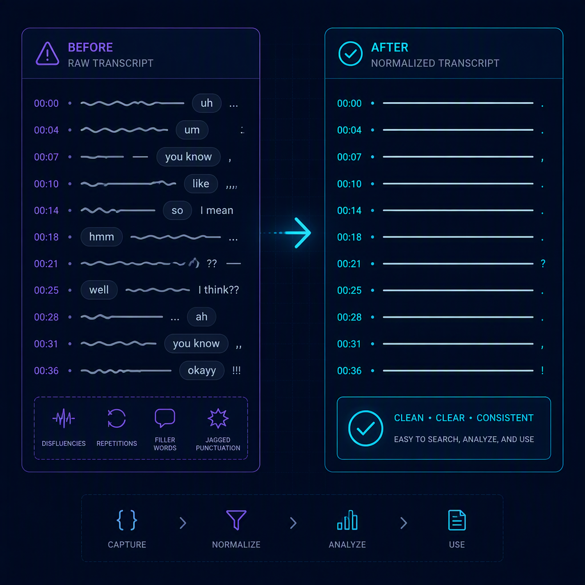

# Local transcript cleanup in .NET with s1-mini

My favorite demo for this library is intentionally small:

| Raw ASR transcript | Cleaned by s1-mini |
|---|---|
| `you don't have any any any any change at all?` | `You don't have any change at all.` |

That `any any any any` collapse is the interesting part. This is more than deleting a list of filler words. It is transcript normalization: turning the rough text emitted by speech-to-text into something a human would actually write.

[`superwhisper/s1-mini`](https://huggingface.co/superwhisper/s1-mini) is a 0.6B-parameter Qwen3 fine-tune with one job: **ASR transcript normalization**. It is not a chat model. It is not a speech model. It does not listen to audio. It takes an existing raw speech-to-text transcript and rewrites it as clean written text.

[`ElBruno.S1Mini`](https://github.com/elbruno/ElBruno.S1Mini) packages that workflow for .NET developers. It downloads an ONNX conversion from Hugging Face on first use, runs it locally with ONNX Runtime GenAI, and exposes a small C# API for normalizing transcripts. Nothing leaves the machine.

The current NuGet package is [`ElBruno.S1Mini` 0.1.1](https://www.nuget.org/packages/ElBruno.S1Mini). It targets `net8.0` and `net10.0`, and the C# code is MIT licensed.

## The basic C# sample

Install the package:

```bash
dotnet add package ElBruno.S1Mini
```

Then normalize a transcript:

```csharp
using ElBruno.S1Mini.Normalization;

using var normalizer = await TranscriptNormalizer.CreateAsync();

var cleaned = await normalizer.NormalizeAsync(
    "you don't have any any any any change at all?");

Console.WriteLine(cleaned);
// You don't have any change at all.
```

On first use, the library downloads `elbruno/s1-mini-onnx` from Hugging Face into `%LOCALAPPDATA%/ElBruno/S1Mini/models`. The default model subfolder is `int4`, about 390 MB on disk, and subsequent runs use the cached copy.

The main API is deliberately small:

```csharp
using ElBruno.S1Mini.Normalization;

using var normalizer = await TranscriptNormalizer.CreateAsync();

var cleaned = await normalizer.NormalizeAsync(
    "so um i need to like send the the report by uh friday no wait make that thursday",
    new TranscriptNormalizerOptions
    {
        Styling = TranscriptStyling.SemiFormal,
        Structure = TranscriptStructure.Prose,
        Context = TranscriptContext.General,
        MaxTokens = 1024,
    });

Console.WriteLine(cleaned);
// So I need to send the report by Thursday.
```

You can also configure the local model cache:

```csharp
using ElBruno.S1Mini;
using ElBruno.S1Mini.Normalization;

var s1Options = new S1MiniOptions
{
    CacheDirectory = @"C:\models",
    EnsureModelDownloaded = true,
};

using var normalizer = await TranscriptNormalizer.CreateAsync(s1Options);
```

Or register it with dependency injection:

```csharp
using ElBruno.S1Mini;

builder.Services.AddTranscriptNormalizer(options =>
{
    options.CacheDirectory = @"C:\models";
});
```

The package also exposes `S1MiniClient`, an `IChatClient` implementation for `Microsoft.Extensions.AI`, but the warning still matters: s1-mini is not a general chat model. `TranscriptNormalizer` is the safer layer because it builds the prompt shape the model expects.

## What the model actually cleaned today

These outputs were measured with the library today using greedy decoding and default options:

| Raw transcript | s1-mini output |
|---|---|
| `you don't have any any any any change at all?` | `You don't have any change at all.` |
| `so um i need to like send the the report by uh friday no wait make that thursday` | `So I need to send the report by Thursday.` |
| `and then we we we need to to look at the the numbers` | `And then we need to look at the numbers.` |
| `i think we should uh go with with option b i mean option c` | `I think we should go with option C.` |
| `the the total was like twenty five dollars and uh fifty cents` | `The total was like $25.50.` |
| `lets meet at uh three thirty on on tuesday the the tenth` | `Let's meet at 3:30 on Tuesday the 10th.` |



The examples show several useful behaviors in a compact set:

- filler removal: `um`, `uh`
- stutter and repetition collapse: `we we we`, `the the`, `any any any any`
- self-correction resolution: `option b i mean option c` becomes `option C`
- spoken-to-written numerals and currency: `twenty five dollars and fifty cents` becomes `$25.50`
- date and time formatting: `three thirty on tuesday the tenth` becomes `3:30 on Tuesday the 10th`

One honest caveat is visible in the currency example: the model kept the colloquial `like` in `The total was like $25.50.` That is a good reminder of the boundary. This is a normalizer, not a rewriter. It cleans speech artifacts, punctuation, casing, numbers, dates, and corrections. It does not always turn casual phrasing into formal prose.

## The live microphone sample

The repository includes a Windows-only sample at `src/samples/LiveMicTranscription`. Its pipeline is:

```text
microphone (NAudio, 16 kHz mono)
  -> Silero VAD v5 (ElBruno.Realtime.SileroVad, ~2 MB)
  -> Whisper (ElBruno.Whisper)
  -> s1-mini (ElBruno.S1Mini)
```

The console UI is built with [Spectre.Console](https://spectreconsole.net/). The sample supports live microphone capture, but it also supports repeatable runs:

```bash
dotnet run --project src/samples/LiveMicTranscription -- --save-audio

dotnet run --project src/samples/LiveMicTranscription -- --wav recordings
```

`--save-audio` records detected utterances. `--wav <file|folder>` replays a saved file or folder through the identical pipeline. That matters because live microphone testing is otherwise not repeatable. Every take is a different performance.

<!-- SCREENSHOT: Insert a real console screenshot of the Spectre.Console pipeline/model selection screen here. -->
*Caption: The live microphone sample loads Whisper, Silero VAD, and s1-mini locally before listening.*


The pipeline shape is not decorative. It came from debugging a real failure mode.

### The filler-word paradox

The whole point of s1-mini is removing fillers like `um` and `uh`. The first version of the sample used a simple energy-threshold voice activity detector. That sounds reasonable until you remember what fillers are acoustically: low-energy sounds near the noise floor.

The threshold gate removed the exact words the model was supposed to clean. Whisper never received them. s1-mini then had nothing to remove, and the model looked broken.

The fix was switching to a neural VAD: **Silero VAD v5** via `ElBruno.Realtime.SileroVad`. Silero is small, around 2 MB, but it classifies speech instead of only measuring loudness. Quiet fillers survive long enough to reach Whisper.

There was a second, subtler bug. Silero returns multiple speech segments. If you concatenate only those segments, you delete the quiet audio between them. That mangles prosody and can make Whisper lose the very hesitation you wanted to preserve.

The correct approach is to use Silero's timestamps to cut one contiguous slice: first segment start to last segment end, with about 400 ms of padding. The same spoken sentence produced this A/B result:

| Strategy | Audio captured | Whisper output |
|---|---:|---|
| Energy threshold | 3.0 s | `So, um, hello.` (truncated at the first pause) |
| Silero, segments concatenated | 8.9 s | fillers lost in the seams |
| Silero + contiguous slice | 12.6 s | word-for-word exact, all 3 fillers preserved |

<!-- SCREENSHOT: Insert a real console screenshot showing raw Whisper output beside cleaned s1-mini output here. -->
*Caption: The useful view is side-by-side: raw ASR transcript first, normalized text second.*

A common explanation is that Whisper strips disfluencies because it was trained on subtitles. That was tested here and was false for this setup. Whisper Tiny and Base both retained 4/4 fillers verbatim. Larger Whisper models do tidy more aggressively, so the sample defaults matter when you are testing cleanup behavior.

## Bonus: the ONNX migration and how s1-mini works internally

The ONNX model used by the package is [`elbruno/s1-mini-onnx`](https://huggingface.co/elbruno/s1-mini-onnx), an **explicitly unofficial, unaffiliated, non-endorsed** derivative of [`superwhisper/s1-mini`](https://huggingface.co/superwhisper/s1-mini). The upstream model is Apache-2.0 with a naming clause. The C# code in this repository is MIT. The downloaded weights remain under the upstream Apache-2.0 license.

The conversion exists so .NET apps can run s1-mini locally through `Microsoft.ML.OnnxRuntimeGenAI` 0.15.1. The package uses INT4 by default, and that is the variant to use today.

The Hugging Face repository also publishes an `fp16/` folder, but that variant is broken on CPU with `onnxruntime-genai` 0.15.1. Every prompt fails with a shape mismatch in the GQA `repeat_kv` Reshape node. This is an ONNX Runtime builder/graph-optimizer bug for FP16 + GQA on the CPU execution provider, not something specific to this conversion. `S1MiniOptions.ModelSubPath` defaults to `int4` for exactly this reason.

There is another runtime edge case worth documenting: `temperature=0`. The model should run with greedy decoding. Callers should be able to pass `Temperature = 0f`. But `onnxruntime-genai`'s native runtime crashes with an integer divide-by-zero if a literal `temperature=0.0` is passed into native search options, even when `do_sample=False`.

`ElBruno.S1Mini` guards that at the runtime layer. `Temperature <= 0` is treated as the library-wide greedy contract, and the native `temperature` option is omitted. That keeps greedy decoding safe without changing it into sampling.

Internally, `TranscriptNormalizer` sends the exact system prompt expected by the model:

```text
You are a text normalizer for speech-to-text transcripts. The input begins with a control line
specifying the styling, structure, and context settings; clean the transcript to match those
settings and output only the cleaned text.
```

Then it builds a one-line control header followed by the raw transcript:

```text
[Styling: semi-formal] [Structure: prose] [Context: general]
so um i need to like send the the report by uh friday no wait make that thursday
```

That control line is what steers the model's behavior. The prompt is rendered with the Qwen3 non-thinking chat format, ported verbatim from the model's own `chat_template.jinja` and verified byte-for-byte against the real model. The assistant generation prompt ends with an empty thinking block:

```text
<|im_start|>assistant
<think>

</think>

```

That selects Qwen3 non-thinking mode, which is what s1-mini expects.

The control values are useful, but they are not all equally literal. Empirical testing showed:

| Option | Value | Verified behavior |
|---|---|---|
| `Styling` | `SemiFormal` | Default. Natural cleanup with contractions preserved. |
| `Styling` | `Formal` | Distinct. Expands contractions and uses a more formal register. |
| `Styling` | `Casual` | Distinct. Keeps more filler/casing/contraction behavior; minimal cleanup. |
| `Structure` | `Prose` | Default continuous prose. |
| `Structure` | `Lists` | Does not reliably produce Markdown bullets or numbered lists. Do not rely on it for machine-parseable output. |
| `Context` | `General` | Default baseline. |
| `Context` | `Email` | Distinct. Produces greeting/body/sign-off structure. |
| `Context` | `Message` | Accepted, but behaves like `General` in tested transcripts. |
| `Context` | `Notes` | Accepted, but behaves like `General` in tested transcripts. |

That table is important because API names can imply more than the model actually guarantees. The docs should reflect measured behavior, not the model card we wish we had.

Finally, the upstream quality number should be attributed correctly: Superwhisper reports **94.8% token accuracy on 7,519 held-out English cases**. That is their measurement, not an independent benchmark from this project. This is English only, v1.

For .NET developers, the practical result is straightforward: if you already have raw ASR text and want local cleanup, `ElBruno.S1Mini` gives you a small API, a cached local model, and a pipeline that stays on your machine.

Links:

- GitHub: https://github.com/elbruno/ElBruno.S1Mini
- NuGet: https://www.nuget.org/packages/ElBruno.S1Mini
- Upstream model: https://huggingface.co/superwhisper/s1-mini
- ONNX model: https://huggingface.co/elbruno/s1-mini-onnx
